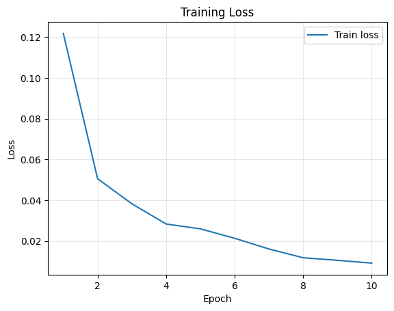
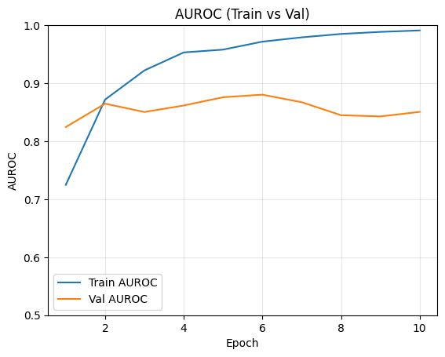
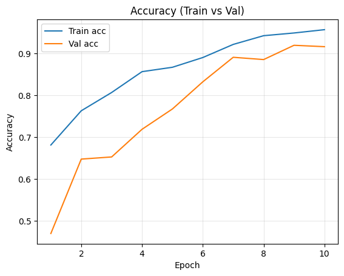
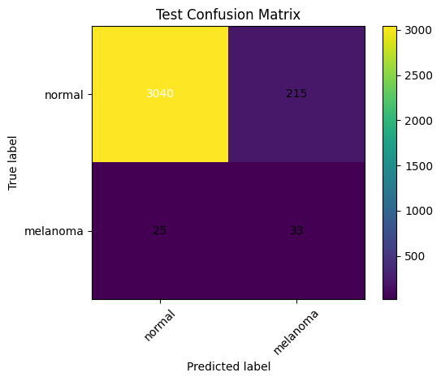
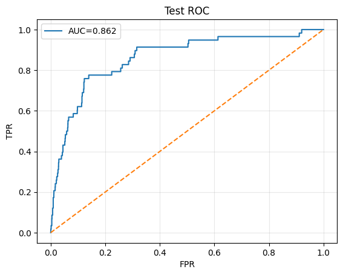

# Classifying ISIC 2020 Data Set with a Siamese Network

## Abstract

This project develops a Siamese neural network in PyTorch to classify images from the ISIC 2020 Kaggle Challenge into normal and melanoma categories. The model leverages a ResNet backbone combined with a 128-dimensional projection head, learning a discriminative embedding space through triplet-loss pretraining before fine-tuning for binary classification.
A key objective was to reach a test accuracy exceeding 0.8, the official benchmark for this hard-difficulty task - a target that was successfully achieved. Beyond accuracy, the project evaluates performance using AUROC and precision-recall analysis to better account for class imbalance inherent to melanoma detection. The results demonstrate that embedding-based pretraining improves generalisation and convergence stability, though the discussion highlights the limitations of relying solely on accuracy as a success criterion for medical classification problems.

## Success Criterion

### **Official Performance Benchmark**

According to the COMP3710 project specification, the success criterion for this hard-difficulty task is to achieve an accuracy ≥ 0.8 on the test set of the ISIC 2020 Kaggle Challenge.
Our final Siamese network comfortably meets this requirement, attaining:
`[TEST]  accuracy=0.9276`
### **Limitations of Accuracy as a Metric**

While accuracy exceeds the benchmark, it is not a fully reliable indicator of real-world performance for this dataset. The ISIC 2020 data has a high degree of class imbalance, with only 1.76% (584 / 32,542) of samples representing melanoma and 98.24% (31,958 / 32,542) representing normal skin. In such an imbalanced setting, a naïve classifier that predicts every image as “normal” would already achieve around 98% accuracy - masking potentially poor sensitivity to melanoma detection. 
Therefore, aditional to accuracy, metrics such as Area Under ROC Curve (AUROC), percision, and confusion matrices were also used to provide a more complete evaluation of the model's effectiveness or ineffectiveness. 


## Codebase Structure and Requirements

### File Structure
The file structure for the codebase is as follows:
```PatternAnalysis-2025/recognition/Siamese_s4802236/
│
├── README_images/
│   ├── image_1.png
│   ├── image_2.png
│   └── ...
│
├── dataset.py
├── modules.py
├── predict.py
├── train.py
├── report.py
├── requirements.txt
└── README.md
```

### Dependencies and Requirements

`requirements.txt` provides a summary of all the required packages to run the code as follows: 

```kagglehub==0.3.13
matplotlib==3.10.7
numpy==2.3.4
pandas==2.3.3
Pillow==12.0.0
scikit_learn==1.7.2
torch==2.7.1
torch==2.9.0
torchvision==0.24.0
```

## Methodology

### Data Preparation
#### Introduction to Dataset
The dataset used for this project is the ISIC 2020 Kaggle Challenge dataset. The dataset contains over 33,000 dermoscopic images of unique skin lesions collected from more than 2,000 patients, with the task being to classify each lesion as either melanoma or benign (normal). Due to the large size and resolution of the original dataset, this project makes use of a resized version of the ISIC 2020 dataset sourced from Kaggle:
[**nischaydnk/isic-2020-jpg-224x224-resized**](https://www.kaggle.com/datasets/nischaydnk/isic-2020-jpg-224x224-resized)

This dataset contains:
- 33,126 dermoscopic images resized to 224×224 pixels.
- A single metadata file (train-metadata.csv) containing the image names and their corresponding labels (target = 1 for melanoma, 0 for benign).
- All images located within train-image/image/

#### Preprocessing
The data is automatically downloaded and organised by the prepare_isic2020() function within dataset.py, which:
- Downloads the dataset via KaggleHub
- Copies the relevant image and metadata files into a local /data/ directory
- Produces a clean, ready-to-use folder and metadata CSV file for the remainder of the pipeline.

#### Dataset Train–Validation–Test Split

Once downloaded, the dataset is divided into three subsets using stratified sampling to preserve the overall class distribution:
- Train:
    - 80% of data 
    - Used for model learning (and triplet training)

- Validation: 
    - 10% of data 
    - Used during training to monitor generalisation and enable early stopping

- Test Set:
    - 10% of data 
    - Used only after training to evaluate final model performance.

#### Overcomming Dataset Imbalance

The ISIC 2020 dataset exhibits severe class imbalance, with only 1.76% (584 / 32,542) of images labelled as melanoma and 98.24% as normal.

To mitigate this issue, class weighting and oversampling strategies are used:
- The minority (melanoma) class is oversampled during `DataLoader` creation using a `WeightedRandomSampler`, ensuring that the model sees both classes equally often during training.
- Class weights are also computed and passed to the loss function to penalise misclassification of melanoma samples more heavily.

### Data Augmentation and Normalisation

To improve generalisation and reduce overfitting, extensive data augmentation is applied to the training set using `torchvision.transforms`.

Augmentations include:
- `RandomHorizontalFlip(p=0.5)` — left–right flips.
- `RandomAffine(degrees=15, translate=(0.05, 0.05), scale=(0.95, 1.05))` - spatial variance
- `ColorJitter(brightness=0.15, contrast=0.15, saturation=0.15, hue=0.02)` - subtle colour augment

All images are also normalised using ImageNet mean and standard deviation.

#### Triplet Data Generator

For Siamese network training, the model requires inputs in the form of triplets:
`(Anchor, Positive, Negative)`

The class TripletSet in dataset.py automates this process:
1. Groups image indices by class (normal or melanoma).
2. Randomly samples valid triplets during each training iteration.
3. Returns the three images and the anchor label to the training loop.

This structure enables the use of the Triplet Margin Loss, which encourages embeddings of similar lesions to cluster together in feature space while pushing apart dissimilar ones.


### Model Architecture

#### Overview
The model uses a ResNet-18 backbone pretrained on ImageNet, followed by a compact 128-dimensional projection head. During the triplet pre-training stage, the model learns to map anchor, positive and negative images into an embedding space where same-class examples are close and different-class examples are far. After that, the encoder is reused with a simple linear classification head (128 → 2) for binary melanoma vs normal classification.

Key:

- ResNet-18 acts as feature extractor, with final fully-connected layer being replaced by identity.
- Projection head: Linear → ReLU → Dropout → Linear → Normalisation (embedding space).
- Training Stages:
    - Metric learning (triplet loss)
    - Classifier fine-tuning

- Optimiser: AdamW; LR schedule: cosine annealing; augmentations + class balancing applied during training.


### Training and Predictions Procedure

#### Training Phase
Training was conducted in two distinct stages — Triplet Pretraining and Classifier Fine-tuning — to leverage both metric learning and supervised classification.

##### Triplet Pretraining:
- The Siamese network is first trained using Triplet Margin Loss to learn a discriminative embedding space.
- The objective is to minimise the distance between anchor and positive embeddings while maximising the distance to negatives.
- The model is trained for three epochs of triplet loss pretraining before classifier training begins.

##### Classifier Fine-Tuning:
- After pretraining, the ResNet-18 encoder weights are reused and a linear classification head (128 → 2) is attached.
- The model is then fine-tuned end-to-end using Cross-Entropy Loss with class weights to address dataset imbalance.
- Optimisation is performed using the AdamW optimiser with a cosine-annealing learning rate schedule, and early stopping is triggered based on validation accuracy and the best performing model is saved as `checkpoint_best.pth`.

#### Predictionm and Evaluation Phase

Once training completes, the trained model is evaluated on the test set via `predict.py` (or automatically from `train.py `with `--run_predict`).

Using this run, the following metrics for the test data are computed:
- Accuracy: Proportion of correctly classified samples.
- AUROC: Measures trade-off between sensitivity and specificity — great for this imbalanced dataset. 
- Confusion Matrix: Visualises classification distribution across both classes.


The aforementioned resulting metrics from our test set then form our results and allow us to conclude findnings.

## Results and Findings

### Major Performance Metrics

After three epochs of triplet pretraining, the model’s average triplet loss reduced from ~0.1190 to ~0.0170, indicating a substantial improvement in embedding separation. 

Training loss also continuously declined during the 10 epochs of classifier fine-tuning while both training accuracy and AUROC improved across epochs





The consistent reduction in training loss across both the triplet pretraining and classifier fine-tuning phases indicates that the model is learning progressively meaningful and discriminative features from the data. As expected, the loss reduces marginally less and less as the number of epochs increase, with the largest reduction in loss coming from the very first epoch (from 0.12 to 0.05). This indicates that as loss starts to plateu, any additional epochs may only overfit the model and therefore only a reasonable 10 epochs were used. 

During classifier fine tuning during training, a final training accuracy of ~95.70% was reached wich a final training AUROC of ~99.10%. The best validation accuracy reached ~91.97% at epoch 9, though validation AUROC peaked earlier (~0.8803 at epoch 6) and declined thereafter, suggesting some over-fitting.

Upon completing training, our test data metrics indicated an accuracy of 0.9276 and an AUROC of 0.8620, both metrics higher than the 0.8 accuracy specified by the task. 

These figures show strong overall performance: the model exceeds the official benchmark (accuracy ≥ 0.8), has a high accuracy, and a respectable AUROC — demonstrating that it reliably distinguishes melanoma from benign in many cases.

### Confusion Matrix & False Negatives

However, when we examine the test classification report more closely, a critical nuance emerges:

```Test classification report:
               precision    recall  f1-score   support

      normal       0.99      0.93      0.96      3255
    melanoma       0.13      0.57      0.22        58

    accuracy                           0.93      3313
   macro avg       0.56      0.75      0.59      3313
weighted avg       0.98      0.93      0.95      3313

```

For the normal class, both percision and recall were high (0.99 and 0.93 respectively), indicating that most normal lessions were correctly identified by our model. 

However, for the melanoma class, percision and recall stood at just 0.13 and 0.57 respectively. This indicates that our model only identified 57% of melanoma cases correctly, meaning 43% of melanoma cases were mis-classified as normal ("false negatives").

This can also be seen by the graphical representation in the confusion matrix: 



In a medical context, this rate of false negatives is significant. Studies show that missed melanoma diagnoses lead to delayed treatment and poorer outcomes: for example, one study found that false negative diagnoses of melanoma occurred in ~18.5% of cases and were associated with delayed excision (Osborne et al., 1999). The FNR rate commonly being 18.5% also indicates that the current Siamese network based model developed is not up to medical standards. 

Thus, while the accuracy (0.9276) is high, the low recall for melanoma reveals a real limitation: in practice, many malignant lesions may still go undetected by this model and therefore needs an evaluation of its limitations. 

This may sound unusual, since the Area Under the ROC Curve (AUROC) of 0.862 means that, on average, there is an 86.2 % probability the model assigns a higher melanoma probability to a true melanoma image than to a random benign one. This reflects a strong level of separability between classes and confirms that the Siamese ResNet-18 model has learned a discriminative feature space. 


However, the curve does not fully reach the top-left corner — the region representing perfect sensitivity and specificity. In practice, although the high AUC signifies good ranking ability, the model still misses almost half of the melanomas at the default 0.5 classification threshold (as shown in the confusion-matrix analysis). For screening systems, sensitivity is far more critical than precision and the threshold should therefore be tuned to favour recall even if more false positives occur.

A recent review in BMC Medical Research Methodology (2024) explicitly includes Youden’s J as a standard method to select the optimal cut-point in clinical biomarker studies (Mojtaba Hassanzad & Karimollah Hajian-Tilaki, 2024). This could be used to replace the current static 0.5 classification threshold to allow for more sensitivity. 


## References

Osborne, J. E., Bourke, J. F., Graham-Brown, R. A. C., & Hutchinson, P. E. (1999). False negative clinical diagnoses of malignant melanoma. British Journal of Dermatology, 140(5), 902–908. https://doi.org/10.1046/j.1365-2133.1999.02823.x
‌
Mojtaba Hassanzad, & Karimollah Hajian-Tilaki. (2024). Methods of determining optimal cut-point of diagnostic biomarkers with application of clinical data in ROC analysis: an update review. BMC Medical Research Methodology, 24(1). https://doi.org/10.1186/s12874-024-02198-2
‌
